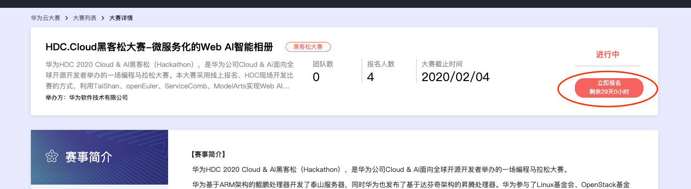

# Apache ServiceComb 黑客松活动 - 微服务化的AI web相册

华为HDC 2020 黑客松（Could & AI），是华为公司Cloud & AI面向全球开源开发者举办的一场编程马拉松大赛。华为开发ARM架构的泰山服务器，达芬奇架构的昇腾AI处理器，面向AI开发者的开发平台modelArts，希望开发者能够借助这些软硬件和开源一站式微服务框架Apache ServiceComb，开发出充满创意的应用.

## 1. 奖项设置
本次大赛每个赛题排名第1和第2的团队将获得：
HDC.Cloud 2020 开源黑客松获奖证书！
价值3999元的Atlas 200 DK AI开发者套件，团队成员每人一套！

所有完成任务的团队将获得：
香蕉派开发板，团队成员每人一台！
黑客松纪念T恤，团队成员每人一件！

所有报名初选通过的参赛团队成员均会赠送华为HDC价值1024的普通票，不需要另外购票入场！

## 2. 报名组队
本次黑客松以团队赛形式进行，开发者可自由组队报名，每个队伍3-5人, 最终评比的是团队输出。

## 3. 大赛日程
报名阶段：2019年12月24日9时-2020年2月4日18时
比赛阶段：2020年2月11日11时- 2020年2月12日16时（HDC.Cloud 2020现场比赛）
地点：大会地址深圳市福田区会展中心

## 4. 赛题介绍
   微服务化的Web AI智能相册。本赛题要求在TaiShan、openEuler的基础环境上，利用Apache ServiceComb微服务框架及其组件，开发一个具有照片智能标注，并能根据标注情况高效浏览的Web智能相册应用。
   赛题详情：https://competition.huaweicloud.com/information/1000029327/introduction
   主办方会提供赛题所需要的TaiShan、openEuler的的VPS. 参赛队伍需要自备笔记本电脑。
## 5. 参赛方式
  参赛是完全免费的，但参赛名额有限，感兴趣的小伙伴火速报名吧!!!
  报名步骤：
  * step 1: 登录 https://competition.huaweicloud.com/information/1000029327/introduction， 点击
  
  报名
  * step 2: 扫描二维码，添加Apache ServiceComb微信小助手并提供相关的报名信息。
    

### 关于华为开发者大会 2020

华为开发者大会2020（Cloud）将于2020年2月11日-12日在深圳举办，这是华为面向ICT（信息与通信）领域全球开发者的年度顶级旗舰活动。大会旨在搭建一个全球性的交流和实践平台，开放华为30年积累的ICT技术和能力，以“鲲鹏+昇腾”硬核双引擎，为开发者提供澎湃动力，改变世界，变不可能为可能。本次大会设有两场主题演讲、数十个Codelab、上百场技术论坛、三万平米展区、热门开源项目、创新大赛、初创公司与投资者对接会、黑客松、音乐节等活动，面向企业开发者、初创公司、学生等群体提供个性化内容体验。我们期待与你在一起，梦飞扬！

